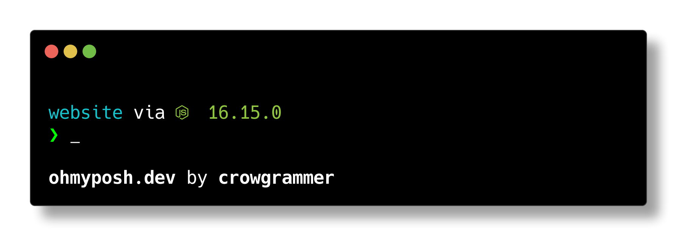
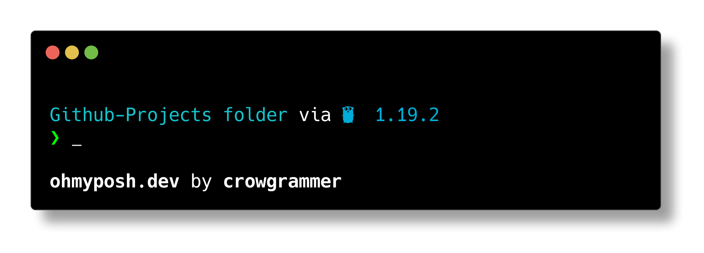

# Neo Dream Oh My Posh Theme

A minimal omp theme that figures out what enviroment you're working within.

it supports a wide veraity of enviroments:

- node
- python
- go
- rust
- ruby
- julia
- DotNet

# Screenshots





# How To Use

<a href="https://ohmyposh.dev/docs/installation/windows" target="_blank">Install Oh My Posh</a>

- Clone the theme and place it the omp theme folder

  Default

  ```path
  C:\Users\[username]\AppData\Local\Programs\oh-my-posh\themes
  ```

- Using Power Shell initialize the .$PROFILE file by running:

  ```pws
  .$PROFILE
  ```

- Open the file in a text editor such as vscode
  ```
  code $PROFILE
  ```
- And add the following
  ```ps1
  oh-my-posh init pwsh --config C:\Users\[username]\AppData\Local\Programs\oh-my-posh\themes\neo-dream.omp.json | Invoke-Expression
  ```
